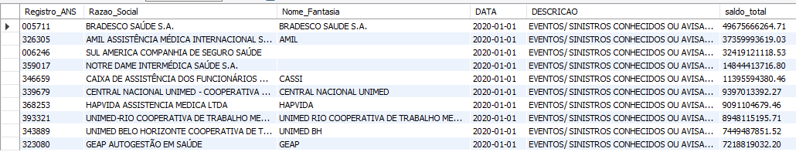

# IntuitiveChallenge

## Intallation
1. antes de começar a executar os primeiros dois programas, é preciso ter o [Python](https://www.python.org/downloads/) instalado.
2. Após instalar, abra o terminal, copie e cole o comando a seguir

    `pip install pandas beautifulsoup4 requests tabula-py`          
3. Instale o [MySQL8](https://dev.mysql.com/downloads/mysql/) para executar o script na pasta `Task3`.

4. Para usar o script é necessário alterar o path nos comandos `LOAD` para o correspondente à maquina que se está utilizando.  

## Saída dos programas
Os arquivos criados e usados por `Task1.py` e `Task2.py` são direcionados para a pasta `output`.

## Reposta das perguntas do Teste 3

### - Quais as 10 operadoras que mais tiveram despesas com "EVENTOS/ SINISTROS CONHECIDOS OU AVISADOS  DE ASSISTÊNCIA A SAÚDE MEDICO HOSPITALAR" no último trimestre?

### - Quais as 10 operadoras que mais tiveram despesas com "EVENTOS/ SINISTROS CONHECIDOS OU AVISADOS  DE ASSISTÊNCIA A SAÚDE MEDICO HOSPITALAR" no último ano?
